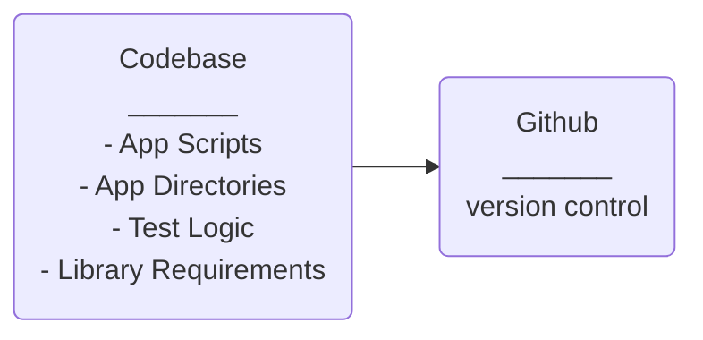
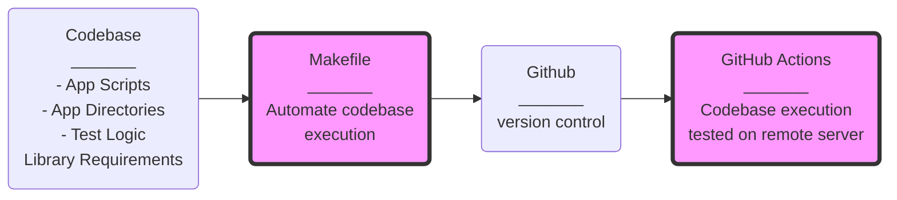

# CICD

Continuous Integration and Continuous Delivery/Deployment makes projects reliable and robust. Debugging and testing large projects is not trivial so CICD should be implemented early in project lifespan.


## Continuous Integration

CI is a development practice where developers integrate code into a shared repository frequently, preferably several times a day. Each integration can then be verified by an automated build and automated tests. While automated testing is not strictly part of CI it is typically implied. When you combine the process with automated testing, continuous integration can enable your code to be dependable.

“Continuous Integration doesn’t get rid of bugs, but it does make them dramatically easier to find and remove.” -Martin Fowler, Chief Scientist, ThoughtWorks

## Continuous Deployment
It is closely related to continuous integration and refers to keeping your application deployable at any point. It involves frequent, automated deployment of the master branch to a production environment following automated testing.

## Continuous Delivery

It is the discipline of being able to reliably release application changes (code) at any time. Beyond making sure your application passes automated tests it has to have all the configuration necessary to push it into production. CD encompasses everything from ideation to build to readiness to delivery to production. Automation is implicit. There is no CI+ CD or CI/CD, continuous delivery includes continuous integration practices.

## CICD Architecture

A developer builds a codebase for a project and eventually another developer is expected to maintain a project. :see_no_evil: :hear_no_evil: :speak_no_evil: Finding the project logic is not trivial so the scripts are quite fragile and debugging changes is not efficient.

CICD process can be evaluated on the **application reliability** and **developer burden**.

- **App reliability:**
  - Does this work and is it flexible to change?
  - How much effort is required for making changes to the codebase?
  - Are stakeholder requirements being met?

- **Developer burden:**  
  - Are developed solutions maturing or is time consumed putting out fires?  
  - How much time is spent in documentation and maintenance of the codebase?
  - Does developer time writing docs meet all requirements for collaboration?
  > :mag:  Docs and code notes are essential but not a replacement for CICD.

## What are the current CICD methods?

I compare two methods of developer CICD best practices.


**CICD Solution**

Recommended CICD Solution:
- Test project using remote build server, i.e. `Github Actions`.
- Execute scripts using `Makefile`.

**Tech Stack**

Cloud Infrastructure Development

- Use terraform (preferred for DS)
  - Preferred for Microservices
  - Cloud Native

OR

- Build cloudformation using CLI
  - Best for naked applications
    - Architects prefer cloudformation (anecdotal) because their use case varies from the data scientist (DS) use case.


### Option 1 Save to Github

Develop and push code to Github. **Writing custom code and pushing to git is not CICD** and is not much different than saving files to your laptop. For this project to work across environments, I will have to build everything from scratch or attempt to understand all the codebase. Taking over a project is challenging becaues all the learning from the first developer is not available for the next developer.

**Application Reliability**  Scripts are not guranteed to run and local environments are unique.

**Developer Burden** Documentation burden and subject matter expertise is demanding.
- Is knowledge transfer efficient for collaboration?

### Option 2  Github + Github Server + Makefile

Add `Makefile` to automate script execution for all of project requirements. During local development I interactively check my code format and test things before pushing to git.


Make is push buttom automated. I run `make <command>` at CLI to check my project is working as expected.
  - No subject matter expertise required for project
  - Makefile learning curve is lightweight.
  - My Makerfile for this project is ~10 lines long.
### Compare Option 1 and Option 2

| CICD  Method | Application <br> Reliability | Developer <br> Burden | Comments |
|:---------------|:--------------:|:--------------:|:--------------|
| 1. Save codebase to Github  | :thumbsdown: :broken_heart:| :thumbsdown: :broken_heart: | - Fredo you broke my heart <br> - Works on my machine <br> - Finger pointing, blame, lost time <br> - Definition of insanity <br> - This is not CICD|
| 2. Github + Github Actions + Makefile | :+1: :heavy_check_mark: | :+1: :heavy_check_mark: | CICD Progress |



**Option 1 Save codebase to Github** This workflow is often, mistakenly called CICD.

> :vertical_traffic_light: The documentation requirements for this method will never meet expectations for collaboration.

-----------


**Option 2  Github + Github Server + Makefile**

>  :mag: Github Actions uses a developed alternative of the `Makefile`.

--------------------

### Project Tech Stack

Development tools used for simple NLP model using public data from Wikipedia.

**`Makefile`**
A Real World `Makefile` using `fastapi`, `docker`, `ECR` and `Codebuild`.


```shell
install:
	# Install Py lib
	pip install --upgrade pip &&\
		pip install -r requirements.txt
	#cat requirements.txt | xargs poetry add

post-install:
	python -m textblob.download_corpora

git:
	# Update Git Repo
	bash sync_git.sh

format:
	#format code
	black *.py mylib/*.py
lint:
	#flake8 or #pylint
	pylint --disable=R,C *.py mylib/*.py
test:
	#test
	python -m pytest -vv --cov=mylib --cov=main test_*.py
build:
	#build container
	docker build -t deploy-fastapi .
run:
	#run docker
	docker run -p 127.0.0.1:8081:8081 e23c41600ffa
deploy:
	# AWS deploy ECR
	#aws ecr get-login-password --region us-east-1 | docker login --username AWS --password-stdin 561744971673.dkr.ecr.us-east-1.amazonaws.com
	#docker build -t fastapi-wiki .
	#docker tag fastapi-wiki:latest 561744971673.dkr.ecr.us-east-1.amazonaws.com/fastapi-wiki:latest
	#docker push 561744971673.dkr.ecr.us-east-1.amazonaws.com/fastapi-wiki:latest
```


**GH Actions**

This solution is deployed to ECR using **minimal, almost negligible** time in AWS Console.
> :exclamation: The AWS Console is good for learning but deployments are not robust.


```shell
name: Python application test with Github Actions
on: [push]
jobs:
  build:
    runs-on: ubuntu-latest
    steps:
    - uses: actions/checkout@v2
    - name: Set up Python 3.8
      uses: actions/setup-python@v1
      with:
        python-version: 3.8
    - name: Install dependencies
      run: |
        make install  
        python -m textblob.download_corpora

    - name: Lint with pylint
      run: |
        make lint
    - name: Test with pytest
      run: |
        make test
    - name: Format code
      run: |
        make format
    - name: Build Container
      run: |
        make build
```

## End
